# DataVault GitOps — Engineering Journal

> **Format:** Each entry records what was built, the decisions made, the problems encountered, and what was learned. This is a living document — updated at the end of every sprint day.

---

## Week 1, Day 1 — Infrastructure Provisioning with Terraform

**Date:** 11 May 2026  
**Sprint Goal:** Provision the AWS infrastructure that the entire GitOps platform will run on — EC2 instance, ECR repository, IAM roles, KMS encryption, and remote state storage.

---

### What Was Built

| Resource | Purpose |
|---|---|
| S3 bucket (bootstrap) | Remote state storage for Terraform — versioned, KMS-encrypted |
| KMS CMK (bootstrap) | Customer-managed key for state bucket encryption |
| EC2 t3.small | Single-node server that will run k3s + ArgoCD + the DataVault app |
| ECR repository | Private Docker image registry — stores images built by CI pipeline |
| IAM role + instance profile | Grants EC2 passwordless access to ECR via AWS-native identity |
| KMS CMK (app) | Customer-managed key for ECR image encryption, EBS volume, Secrets Manager |
| AWS Secrets Manager secret | Stores the EC2 SSH private key — no credentials on disk |
| Security group + rules | Network firewall — SSH locked to operator IP, all other ports open to required traffic |

S3 Bucket for storing `Terraform Remote State` files:

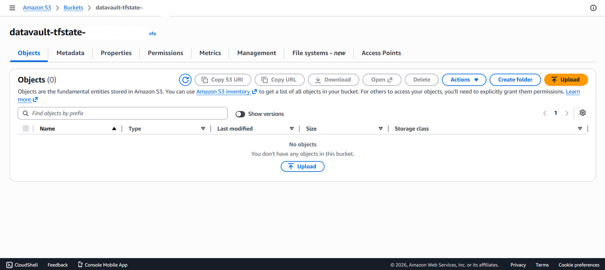
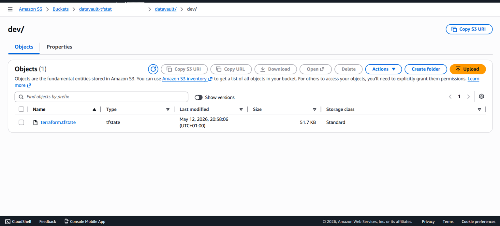

EC2 instance to run as K3s (Kubernetes) node:

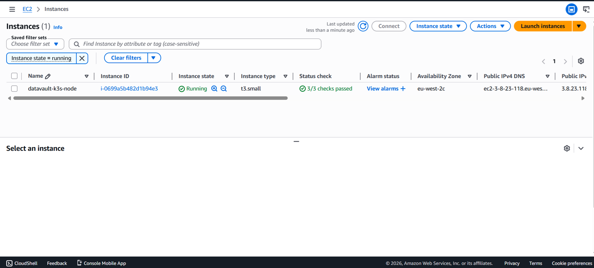
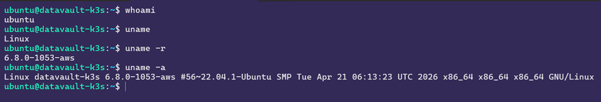
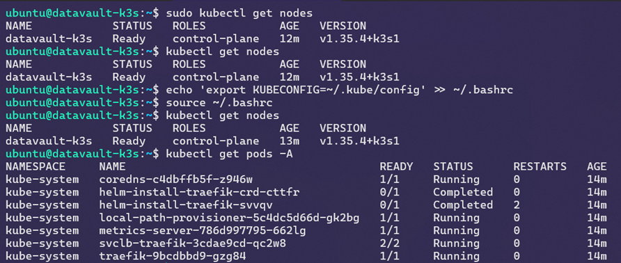

ECR repository for image registry:
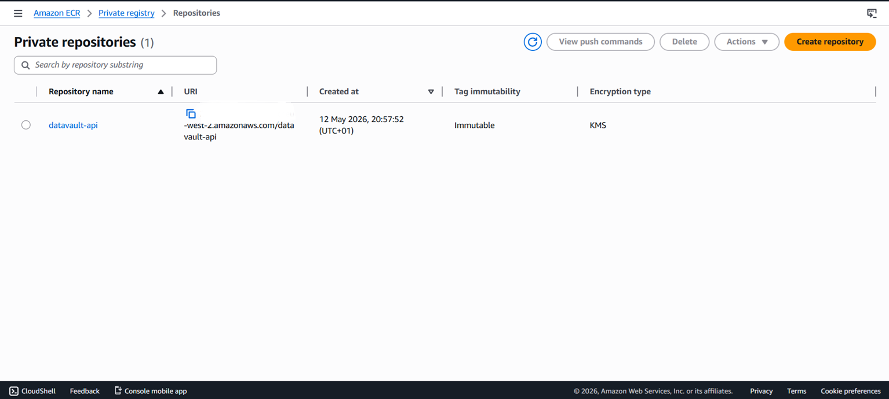
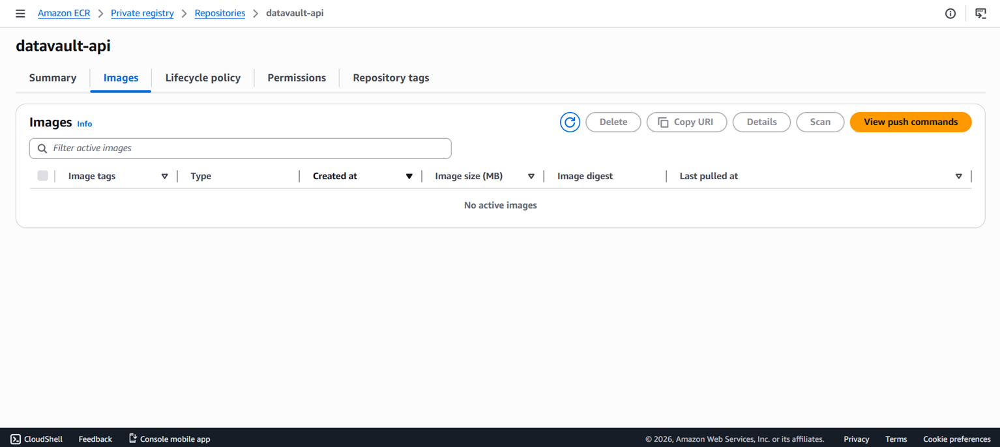

---

### Architecture Decisions

**Why infrastructure first, before the app?**  
Infrastructure-first means every application decision is made with full knowledge of the environment it runs in. Building the app first and then figuring out where it runs leads to constrained infrastructure decisions. The platform shapes the application, not the other way around.

**Why Terraform over clicking in the AWS console?**  
Manual console clicks produce infrastructure that exists only in AWS — undocumented, unreproducible, and invisible to version control. Terraform produces infrastructure that is documented in code, version-controlled in Git, and reproducible by any engineer on the team. If the EC2 instance is terminated tonight, `terraform apply` recreates it identically in under 3 minutes. That is the infrastructure-as-code promise.

**Why a separate bootstrap workspace?**  
Terraform state must be stored somewhere. The natural choice is S3 — but you cannot use Terraform to create an S3 bucket and simultaneously store Terraform's own state in that bucket. The bootstrap workspace solves this chicken-and-egg problem: it runs with local state, creates the S3 bucket, and then the main workspace uses that bucket as its remote backend. The bootstrap workspace is run once and never touched again unless rebuilding from scratch.

**Why eu-west-2 (London)?**  
DataVault serves FCA-regulated UK financial services firms. UK data residency is a compliance requirement — client audit data must remain within UK jurisdiction. `eu-west-2` is AWS London. This is not a preference, it is a regulatory constraint.

**Why t3.small instead of EKS?**  
AWS EKS (managed Kubernetes) costs approximately £70/month for the control plane alone, before any worker nodes. A t3.small running k3s (lightweight Kubernetes) costs approximately £15/month and provides identical Kubernetes API surface — the same `kubectl` commands, the same manifest files, the same ArgoCD integration. For a learning environment and proof-of-concept, k3s on EC2 is the correct choice. The skills transfer directly to EKS.

**Why store the SSH key in Secrets Manager instead of a local file?**  
The original walkthrough referenced `~/.ssh/id_rsa.pub` — a file that exists on one engineer's laptop. If that laptop is lost, the key is gone. If a different engineer needs to SSH in, they cannot. Secrets Manager centralises the key: any authorised team member can retrieve it, access is logged in CloudTrail, and the key never touches the filesystem of the Terraform operator's machine during provisioning.

---

### Security Work — Shift-Left in Practice

Before applying a single resource, the code was scanned with two static analysis tools:

- **tflint** — catches Terraform anti-patterns, unused variables, missing type constraints
- **tfsec** — catches security misconfigurations against AWS security benchmarks

**Initial tfsec scan returned 3 HIGH and 2 LOW findings.** Every finding was resolved in code before `terraform apply` was run. This is shift-left security — catching vulnerabilities at the code review stage rather than discovering them post-deployment or, worse, during an incident.

**Issues caught early by tfsec on the main infra (not the bootstrap/ folder - All passes)**:

```hcl
timings
  ──────────────────────────────────────────
  disk i/o             1.7169ms
  parsing              5.0026ms
  adaptation           1.0041ms
  checks               7.0344ms
  total                14.758ms 

  counts
  ──────────────────────────────────────────
  modules downloaded   0
  modules processed    1
  blocks processed     40
  files read           6

  results
  ──────────────────────────────────────────
  passed               5
  ignored              0
  critical             0
  high                 3
  medium               0
  low                  2

 5 passed, 5 potential problem(s) detected.
```

| Finding | Severity | Resolution |
|---|---|---|
| IMDSv2 not enforced | HIGH | Added `metadata_options { http_tokens = "required" }` to EC2 instance |
| Root EBS volume not encrypted | HIGH | Added `encrypted = true` + CMK reference to `root_block_device` |
| ECR image tags mutable | HIGH | Changed default to `IMMUTABLE`, added validation |
| Secrets Manager using AWS-managed key | LOW | Created CMK, referenced via `kms_key_id` |
| ECR not encrypted with CMK | LOW | Added `encryption_configuration` block with CMK ARN, fixed `encryption_type = "KMS"` (case-sensitive) |

**tflint findings resolved:**

| Finding | Resolution |
|---|---|
| `tls` provider not declared in `required_providers` | Added `tls ~> 4.0` to `provider.tf` |
| `resource_tags` variable declared but unused | Applied via `merge()` function on all resource tag blocks |
| `user_name` and `user_department` missing type constraints | Added `type = string` to both variables |

Final scan result: **11 passed, 0 problems detected.**

```hcl
 tfsec . --format lovely
```

**Output**:

```hcl
  timings
  ──────────────────────────────────────────
  disk i/o             1.5042ms
  parsing              3.1112ms
  adaptation           0s
  checks               3.0067ms
  total                7.6221ms

  counts
  ──────────────────────────────────────────
  modules downloaded   0
  modules processed    1
  blocks processed     43
  files read           7

  results
  ──────────────────────────────────────────
  passed               11
  ignored              0
  critical             0
  high                 0
  medium               0
  low                  0


No problems detected!
```

---

### SSH Key Rotation

The SSH private key stored in Secrets Manager is currently rotated manually. This is acceptable for now but is not a long-term solution for a platform serving 47 FCA-regulated clients.

**Current manual rotation options:**

Option A — Rotate via AWS Console:
1. Go to Secrets Manager → select `datavault/dev-deployer`
2. Generate a new RSA key pair locally: `ssh-keygen -t rsa -b 4096 -f new-key`
3. Update the EC2 instance's `~/.ssh/authorized_keys` with the new public key
4. Update the secret value in Secrets Manager with the new private key
5. Delete the old key pair from EC2 Key Pairs in the console
6. Register the new public key as a new EC2 Key Pair

Option B — Rotate via AWS CLI:
```bash
# Generate new key pair
ssh-keygen -t rsa -b 4096 -f ~/.ssh/datavault-new -N ""

# Import new public key to EC2
aws ec2 import-key-pair \
  --key-name datavault-key-v2 \
  --public-key-material fileb://~/.ssh/datavault-new.pub \
  --region eu-west-2

# Update the secret in Secrets Manager
aws secretsmanager put-secret-value \
  --secret-id datavault/dev-deployer \
  --secret-string file://~/.ssh/datavault-new \
  --region eu-west-2

# Add new public key to the running instance via SSM (no SSH needed)
aws ssm send-command \
  --instance-ids <instance-id> \
  --document-name "AWS-RunShellScript" \
  --parameters commands=["echo '$(cat ~/.ssh/datavault-new.pub)' >> /home/ubuntu/.ssh/authorized_keys"] \
  --region eu-west-2
```

**Future — Automated rotation with AWS Lambda:**  
Both manual options above require human intervention and are not auditable at the granularity FCA compliance demands. The production-grade solution is a Lambda rotation function that executes four steps automatically on a schedule:

- `createSecret` — generates a new RSA key pair in memory (never touches disk)
- `setSecret` — pushes the new public key to the EC2 instance via SSM Run Command and registers a new `aws_key_pair`
- `testSecret` — verifies SSH connectivity with the new key before committing
- `finishSecret` — marks the new version as `AWSCURRENT` in Secrets Manager

The Terraform wiring (`aws_secretsmanager_secret_rotation`, `aws_lambda_permission`, Lambda IAM execution role) and the Python handler will be implemented in a future sprint. The `lifecycle { ignore_changes = [secret_string] }` block is already in place on the secret version resource so Terraform will not overwrite Lambda-rotated values on subsequent applies.

---

### What Was Learned Today

- Terraform workspaces should be separated by concern — bootstrap (state infrastructure) is distinct from application infrastructure
- Static analysis tools (tflint, tfsec) must run before `terraform apply`, not after — this is the shift-left principle in practice
- KMS key policies require a root admin statement — without it you can permanently lose access to your own key
- IMDSv2 with `http_put_response_hop_limit = 1` also prevents containers running inside k3s from reaching the host metadata endpoint — a defence-in-depth measure
- `use_lockfile = true` in the S3 backend replaces the deprecated DynamoDB locking mechanism — requires Terraform >= 1.10.0
- SSH keys should never live on a single engineer's laptop — Secrets Manager centralises access and provides a full audit trail of every retrieval

---

### Tomorrow — Day 2

- `k8s/deployment.yaml` — Kubernetes Deployment with liveness and readiness probes
- `k8s/service.yaml` — NodePort Service to expose the app
- `k8s/configmap.yaml` — non-sensitive environment configuration
- `k8s/secret.yaml` — sensitive configuration (base64 encoded)
- `k8s/hpa.yaml` — Horizontal Pod Autoscaler

---

## Week 1, Day 2 — k3s Setup + DataVault Application + Dockerfile

**Date:** 13 May 2026
**Sprint Goal:** Install Kubernetes (k3s) on the EC2 instance, verify the cluster is healthy, build the DataVault FastAPI application, and produce a production-grade Docker image that runs correctly.

---

### What Was Built

Build the DataVault application layer:
- `app/main.py` — the API simulation
- `app/Dockerfile` — containerise the application

| Component | Detail |
|---|---|
| k3s cluster | Single-node Kubernetes on EC2 t3.small — control plane + worker on same machine |
| kubectl access | Configured on EC2 and local machine — no sudo required |
| `app/datavault-api/app/main.py` | FastAPI application — audit trail API with `/health`, `/ready`, `/api/audit`, `/api/compliance`, `/api/clients` endpoints |
| `app/datavault-api/app/requirements.txt` | Pinned dependencies — fastapi, uvicorn, pydantic |
| `app/datavault-api/app/Dockerfile` | Multi-stage, non-root, production-grade container image |
| Image verified | Container running, all endpoints responding, image pushed to Docker Hub |

---

### Architecture Decisions

**Why k3s instead of standard Kubernetes (kubeadm)?**
Standard Kubernetes requires ~1GB RAM just for the control plane components (etcd, kube-apiserver, controller-manager, scheduler). k3s bundles all of these into a single binary using SQLite instead of etcd, consuming ~300MB. The t3.small has 2GB RAM — k3s fits comfortably, kubeadm would not. Critically, k3s is fully certified Kubernetes — the same `kubectl` commands, the same manifest files, the same API. Skills transfer directly to EKS or GKE.

**Why FastAPI instead of Flask?**
The provided DataVault application uses FastAPI. FastAPI is async-native, significantly faster than Flask under load, and auto-generates OpenAPI/Swagger documentation from route definitions. The `/docs` endpoint gives a live interactive API explorer — useful for the FCA compliance demo. Pydantic models enforce request/response schemas at runtime, which matters for a compliance platform where data integrity is non-negotiable.

**Why multi-stage Docker build?**
Two reasons. First, size — the builder stage installs pip, compilers, and build tools. None of that belongs in the production image. The final image only contains what's needed to run the app, reducing it from ~1GB to ~180MB. Smaller image means faster ECR pulls, faster pod startup, faster rollouts. Second, security — fewer tools in the image means fewer attack vectors. A compromised container with no pip and no build toolchain is significantly harder to exploit.

**Why non-root user in the container?**
Container breakout vulnerabilities exist. If an attacker escapes the container and the process was running as root, they have root on the host node — which in this case runs the entire k3s cluster. Running as `appuser` (uid 10001) limits the blast radius to the container's filesystem and process space.

**Why pin exact dependency versions?**
`pip install fastapi` today and `pip install fastapi` in 6 months can produce different results. Pinned versions (`fastapi==0.115.5`) make every build identical and reproducible. For a platform where every deployment must be auditable, non-reproducible builds are unacceptable.

**Why uvicorn instead of gunicorn?**
The application is FastAPI — an ASGI framework. Gunicorn is a WSGI server. They are incompatible. uvicorn is the correct ASGI server for FastAPI. The `--workers 2` flag gives two worker processes appropriate for the t3.small's 2 vCPU.

---

### Running Application Locally

```bash
uvicorn main:app --reload --port 8000
```

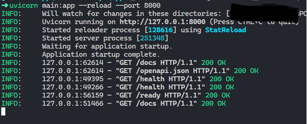
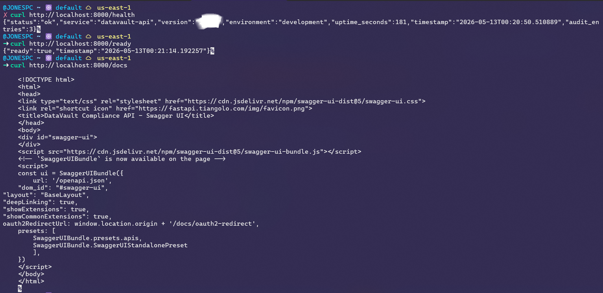

**Check application health**

```bash
curl http://localhost:8000/health
```

```plaintext
{"status":"ok","service":"datavault-api","version":"x.x.x","environment":"development","uptime_seconds":484,"timestamp":"2026-05-13T15:23:25.040904+00:00","audit_entries":3}
```

**Check if application is ready to receive traffic

```bash
http://localhost:8000/ready
```

```plaintext
{"ready":true,"timestamp":"2026-05-13T15:26:20.131568+00:00"}
```

**Test the Application**

```python
pip install pytest httpx
pytest tests/ -v
```

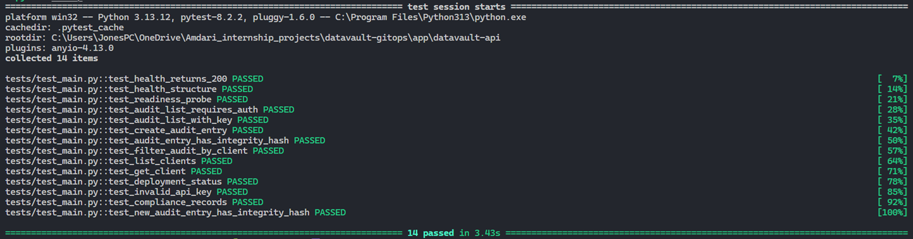

---

### Containerise the Application Locally

Manually built the app with docker:

```bash
docker image build -t datavault-api:1.0.0 .
docker image ls
```

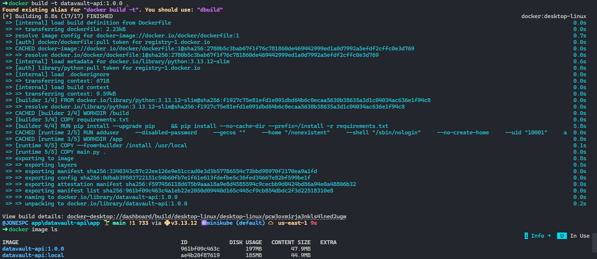

**Tag and push image to Dockerhub***:

```bash
docker image tag datavault-api:1.0.0 kwameds/datavault-api:1.0.0

docker image push kwameds/datavault-api:1.0.0
```

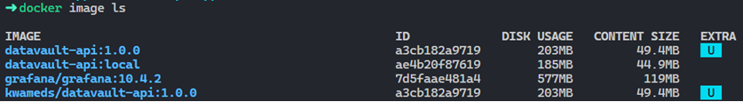
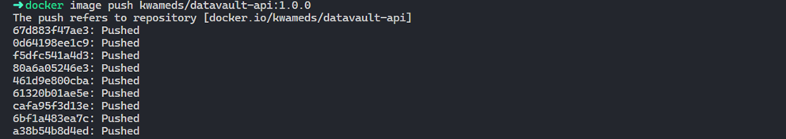

**Image in Dockerhub**:

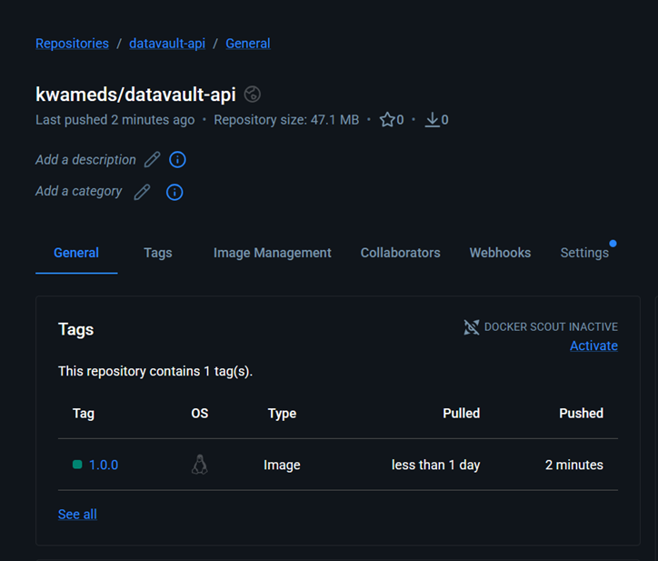

**Run container**:

```bash
 docker run -d -p 8000:8000 \
  -e APP_ENV=local \
  -e API_KEY=datavault-dev-key \
  --name datavault-api \
  kwameds/datavault-api:1.0.0
```

**list containers running**:

```bash
docker container ls
```

**Output**:

```bash
CONTAINER ID   IMAGE                         COMMAND                  CREATED         STATUS                   PORTS                                         NAMES
794496253e0e   kwameds/datavault-api:1.0.0   "uvicorn main:app --…"   2 minutes ago   Up 2 minutes (healthy)   0.0.0.0:8000->8000/tcp, [::]:8000->8000/tcp   datavault-api
```

**Check application health**:

```bash
curl http://localhost:8000/health
```

**Output**:

```plaintext
{"status":"ok","service":"datavault-api","version":"x.x.x","environment":"local","uptime_seconds":846,"timestamp":"2026-05-13T22:46:45.899346+00:00","audit_entries":3}
```

**Audit entries — API key required**

```bash
curl -H "x-api-key: datavault-dev-key" http://localhost:8000/api/audit
```

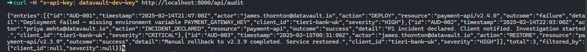

The docker image was built using a `Multi-stage build` in the Dockerfile. This builds smaller, faster and optimised images by separating build and runtime environments. 

**Confirm image size**:

```bash
docker images kwameds/datavault-api:1.0.0
```

**Output**:

```bash
IMAGE                         ID             DISK USAGE   CONTENT SIZE   EXTRA
kwameds/datavault-api:1.0.0   a3cb182a9719        203MB         49.4MB    U   
```

The image size is `49.4MB`. Without the `Multi-stage build`, the image size would be larger than what we have now.

---

### k3s Components Observed

After installation, `kubectl get pods -A` showed:

| Pod | Status | Purpose |
|---|---|---|
| `coredns` | Running | DNS resolution — pods find each other by name, not IP |
| `helm-install-traefik-crd` | Completed | One-off job — installed Traefik CRDs at startup |
| `helm-install-traefik` | Completed | One-off job — installed Traefik ingress controller |
| `local-path-provisioner` | Running | Creates PersistentVolumes on local disk |
| `metrics-server` | Running | Collects CPU/memory metrics — required for HPA |
| `svclb-traefik` | Running | k3s service load balancer for Traefik |
| `traefik` | Running | Ingress controller for HTTP/HTTPS routing |

`Completed` status on the Helm install jobs is correct — these are one-off Jobs, not long-running services. `metrics-server` being pre-installed is a k3s advantage — on standard Kubernetes it requires a separate install step, and without it the HPA cannot function.


---

### What Was Learned Today

- k3s installs with a single `curl` command and produces a fully certified Kubernetes cluster — the same API surface as EKS
- `Completed` pod status is not an error — it means a Job ran successfully and exited cleanly
- `metrics-server` must be running for HPA to work — k3s includes it by default, standard Kubernetes does not
- KUBECONFIG can reference multiple files separated by `:` — this is how you manage multiple clusters without overwriting configs
- FastAPI is ASGI, Flask is WSGI — they require different servers (uvicorn vs gunicorn). Mixing them causes silent container exits
- Multi-stage Docker builds separate build-time dependencies from runtime — smaller, more secure images
- The `/health` and `/ready` endpoints are not optional extras — they are the mechanism Kubernetes uses for self-healing and zero-downtime deployments

---

### Tomorrow — Day 3

Write all five Kubernetes manifests:
- `k8s/configmap.yaml` — non-sensitive environment configuration
- `k8s/secret.yaml` — sensitive configuration (base64 encoded)
- `k8s/deployment.yaml` — Deployment with liveness and readiness probes, 2 replicas
- `k8s/service.yaml` — NodePort Service to expose the app
- `k8s/hpa.yaml` — Horizontal Pod Autoscaler (scale on CPU > 70%)

Apply all manifests to the k3s cluster and verify pods are running.

---
