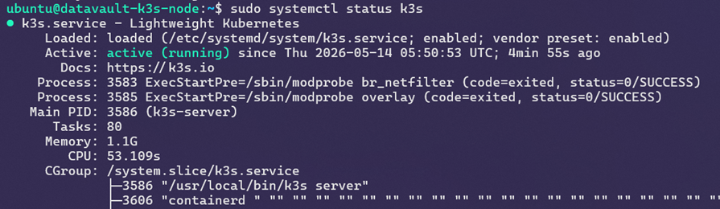
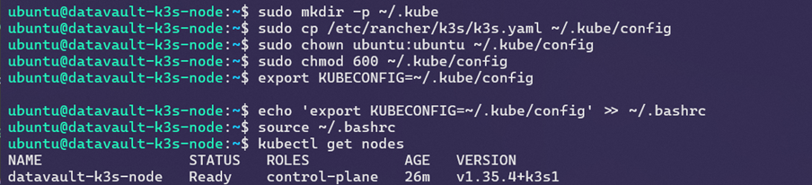
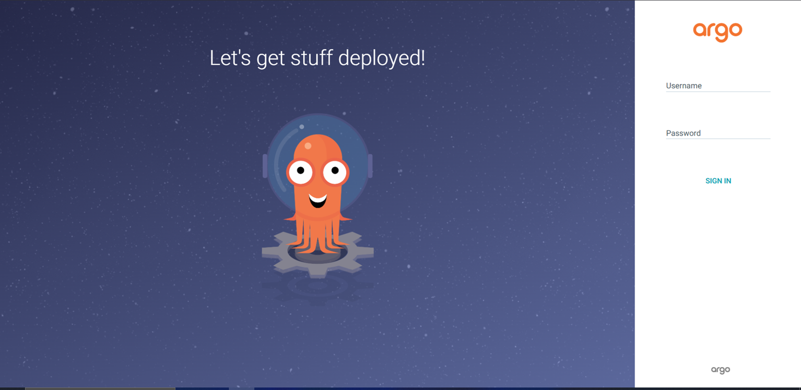
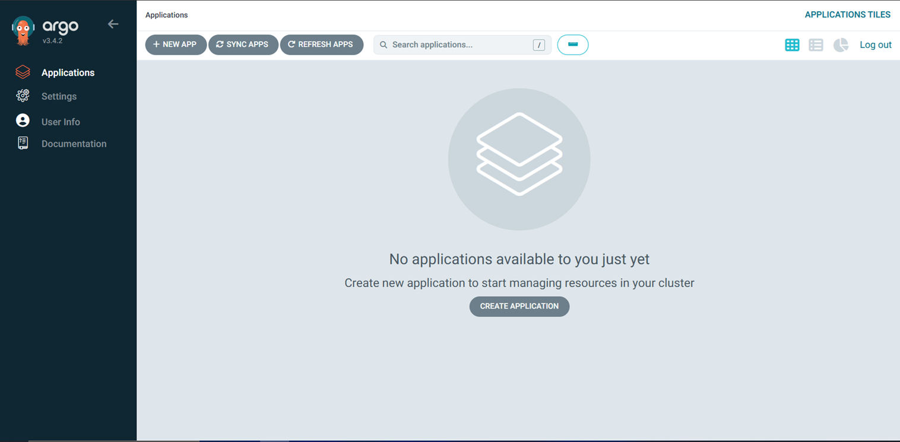
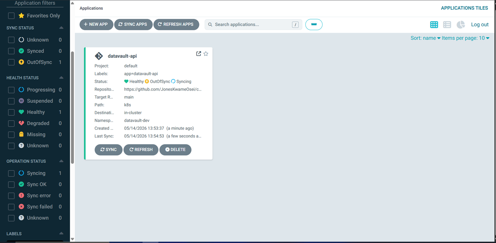
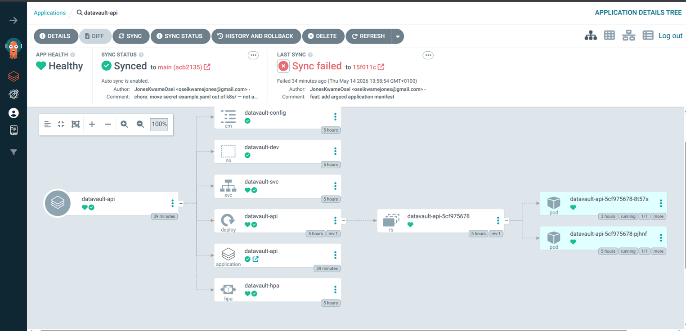
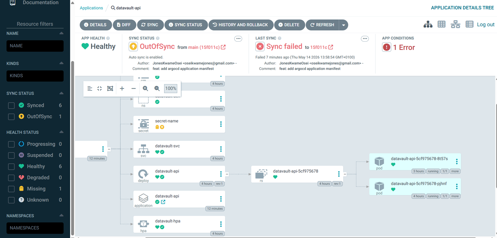
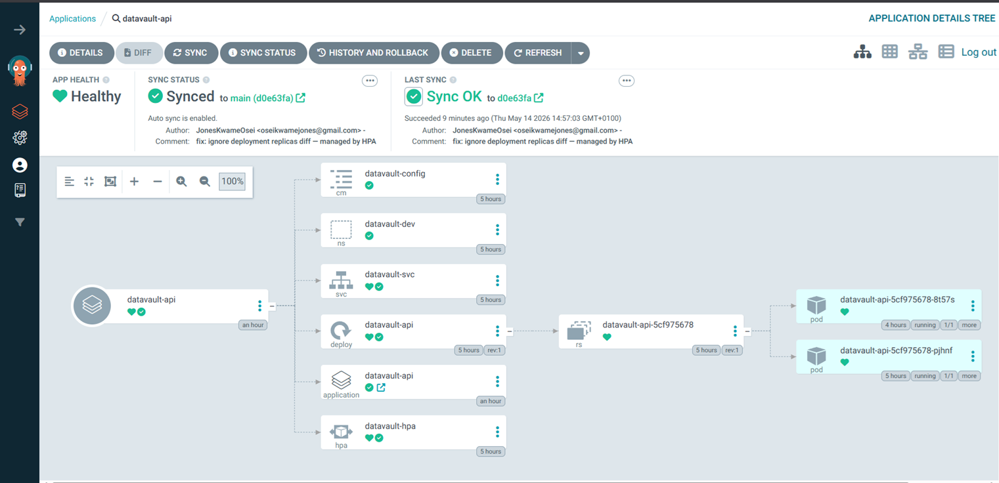

# DataVault GitOps — Engineering Journal

> **Format:** Each entry records what was built, the decisions made, the problems encountered, and what was learned. This is a living document — updated at the end of every sprint day.

---

## Week 1, Day 1 — Infrastructure Provisioning with Terraform

**Date:** 11 May 2026  
**Sprint Goal:** Provision the AWS infrastructure that the entire GitOps platform will run on — EC2 instance, ECR repository, IAM roles, KMS encryption, and remote state storage.

---

### What Was Built

| Resource | Purpose |
|---|---|
| S3 bucket (bootstrap) | Remote state storage for Terraform — versioned, KMS-encrypted |
| KMS CMK (bootstrap) | Customer-managed key for state bucket encryption |
| EC2 t3.small | Single-node server that will run k3s + ArgoCD + the DataVault app |
| ECR repository | Private Docker image registry — stores images built by CI pipeline |
| IAM role + instance profile | Grants EC2 passwordless access to ECR via AWS-native identity |
| KMS CMK (app) | Customer-managed key for ECR image encryption, EBS volume, Secrets Manager |
| AWS Secrets Manager secret | Stores the EC2 SSH private key — no credentials on disk |
| Security group + rules | Network firewall — SSH locked to operator IP, all other ports open to required traffic |

S3 Bucket for storing `Terraform Remote State` files:


EC2 instance to run as K3s (Kubernetes) node:


ECR repository for image registry:


---

### Architecture Decisions

**Why infrastructure first, before the app?**  
Infrastructure-first means every application decision is made with full knowledge of the environment it runs in. Building the app first and then figuring out where it runs leads to constrained infrastructure decisions. The platform shapes the application, not the other way around.

**Why Terraform over clicking in the AWS console?**  
Manual console clicks produce infrastructure that exists only in AWS — undocumented, unreproducible, and invisible to version control. Terraform produces infrastructure that is documented in code, version-controlled in Git, and reproducible by any engineer on the team. If the EC2 instance is terminated tonight, `terraform apply` recreates it identically in under 3 minutes. That is the infrastructure-as-code promise.

**Why a separate bootstrap workspace?**  
Terraform state must be stored somewhere. The natural choice is S3 — but you cannot use Terraform to create an S3 bucket and simultaneously store Terraform's own state in that bucket. The bootstrap workspace solves this chicken-and-egg problem: it runs with local state, creates the S3 bucket, and then the main workspace uses that bucket as its remote backend. The bootstrap workspace is run once and never touched again unless rebuilding from scratch.

**Why eu-west-2 (London)?**  
DataVault serves FCA-regulated UK financial services firms. UK data residency is a compliance requirement — client audit data must remain within UK jurisdiction. `eu-west-2` is AWS London. This is not a preference, it is a regulatory constraint.

**Why t3.small instead of EKS?**  
AWS EKS (managed Kubernetes) costs approximately £70/month for the control plane alone, before any worker nodes. A t3.small running k3s (lightweight Kubernetes) costs approximately £15/month and provides identical Kubernetes API surface — the same `kubectl` commands, the same manifest files, the same ArgoCD integration. For a learning environment and proof-of-concept, k3s on EC2 is the correct choice. The skills transfer directly to EKS.

**Why store the SSH key in Secrets Manager instead of a local file?**  
The original walkthrough referenced `~/.ssh/id_rsa.pub` — a file that exists on one engineer's laptop. If that laptop is lost, the key is gone. If a different engineer needs to SSH in, they cannot. Secrets Manager centralises the key: any authorised team member can retrieve it, access is logged in CloudTrail, and the key never touches the filesystem of the Terraform operator's machine during provisioning.

---

### Security Work — Shift-Left in Practice

Before applying a single resource, the code was scanned with two static analysis tools:

- **tflint** — catches Terraform anti-patterns, unused variables, missing type constraints
- **tfsec** — catches security misconfigurations against AWS security benchmarks

**Initial tfsec scan returned 3 HIGH and 2 LOW findings.** Every finding was resolved in code before `terraform apply` was run. This is shift-left security — catching vulnerabilities at the code review stage rather than discovering them post-deployment or, worse, during an incident.

**Issues caught early by tfsec on the main infra (not the bootstrap/ folder - All passes)**:

```hcl
timings
  ──────────────────────────────────────────
  disk i/o             1.7169ms
  parsing              5.0026ms
  adaptation           1.0041ms
  checks               7.0344ms
  total                14.758ms 

  counts
  ──────────────────────────────────────────
  modules downloaded   0
  modules processed    1
  blocks processed     40
  files read           6

  results
  ──────────────────────────────────────────
  passed               5
  ignored              0
  critical             0
  high                 3
  medium               0
  low                  2

 5 passed, 5 potential problem(s) detected.
```

| Finding | Severity | Resolution |
|---|---|---|
| IMDSv2 not enforced | HIGH | Added `metadata_options { http_tokens = "required" }` to EC2 instance |
| Root EBS volume not encrypted | HIGH | Added `encrypted = true` + CMK reference to `root_block_device` |
| ECR image tags mutable | HIGH | Changed default to `IMMUTABLE`, added validation |
| Secrets Manager using AWS-managed key | LOW | Created CMK, referenced via `kms_key_id` |
| ECR not encrypted with CMK | LOW | Added `encryption_configuration` block with CMK ARN, fixed `encryption_type = "KMS"` (case-sensitive) |

**tflint findings resolved:**

| Finding | Resolution |
|---|---|
| `tls` provider not declared in `required_providers` | Added `tls ~> 4.0` to `provider.tf` |
| `resource_tags` variable declared but unused | Applied via `merge()` function on all resource tag blocks |
| `user_name` and `user_department` missing type constraints | Added `type = string` to both variables |

Final scan result: **11 passed, 0 problems detected.**

```hcl
 tfsec . --format lovely
```

**Output**:

```hcl
  timings
  ──────────────────────────────────────────
  disk i/o             1.5042ms
  parsing              3.1112ms
  adaptation           0s
  checks               3.0067ms
  total                7.6221ms

  counts
  ──────────────────────────────────────────
  modules downloaded   0
  modules processed    1
  blocks processed     43
  files read           7

  results
  ──────────────────────────────────────────
  passed               11
  ignored              0
  critical             0
  high                 0
  medium               0
  low                  0


No problems detected!
```

---

### SSH Key Rotation

The SSH private key stored in Secrets Manager is currently rotated manually. This is acceptable for now but is not a long-term solution for a platform serving 47 FCA-regulated clients.

**Current manual rotation options:**

Option A — Rotate via AWS Console:
1. Go to Secrets Manager → select `datavault/dev-deployer`
2. Generate a new RSA key pair locally: `ssh-keygen -t rsa -b 4096 -f new-key`
3. Update the EC2 instance's `~/.ssh/authorized_keys` with the new public key
4. Update the secret value in Secrets Manager with the new private key
5. Delete the old key pair from EC2 Key Pairs in the console
6. Register the new public key as a new EC2 Key Pair

Option B — Rotate via AWS CLI:
```bash
# Generate new key pair
ssh-keygen -t rsa -b 4096 -f ~/.ssh/datavault-new -N ""

# Import new public key to EC2
aws ec2 import-key-pair \
  --key-name datavault-key-v2 \
  --public-key-material fileb://~/.ssh/datavault-new.pub \
  --region eu-west-2

# Update the secret in Secrets Manager
aws secretsmanager put-secret-value \
  --secret-id datavault/dev-deployer \
  --secret-string file://~/.ssh/datavault-new \
  --region eu-west-2

# Add new public key to the running instance via SSM (no SSH needed)
aws ssm send-command \
  --instance-ids <instance-id> \
  --document-name "AWS-RunShellScript" \
  --parameters commands=["echo '$(cat ~/.ssh/datavault-new.pub)' >> /home/ubuntu/.ssh/authorized_keys"] \
  --region eu-west-2
```

**Future — Automated rotation with AWS Lambda:**  
Both manual options above require human intervention and are not auditable at the granularity FCA compliance demands. The production-grade solution is a Lambda rotation function that executes four steps automatically on a schedule:

- `createSecret` — generates a new RSA key pair in memory (never touches disk)
- `setSecret` — pushes the new public key to the EC2 instance via SSM Run Command and registers a new `aws_key_pair`
- `testSecret` — verifies SSH connectivity with the new key before committing
- `finishSecret` — marks the new version as `AWSCURRENT` in Secrets Manager

The Terraform wiring (`aws_secretsmanager_secret_rotation`, `aws_lambda_permission`, Lambda IAM execution role) and the Python handler will be implemented in a future sprint. The `lifecycle { ignore_changes = [secret_string] }` block is already in place on the secret version resource so Terraform will not overwrite Lambda-rotated values on subsequent applies.

---

### What Was Learned Today

- Terraform workspaces should be separated by concern — bootstrap (state infrastructure) is distinct from application infrastructure
- Static analysis tools (tflint, tfsec) must run before `terraform apply`, not after — this is the shift-left principle in practice
- KMS key policies require a root admin statement — without it you can permanently lose access to your own key
- IMDSv2 with `http_put_response_hop_limit = 1` also prevents containers running inside k3s from reaching the host metadata endpoint — a defence-in-depth measure
- `use_lockfile = true` in the S3 backend replaces the deprecated DynamoDB locking mechanism — requires Terraform >= 1.10.0
- SSH keys should never live on a single engineer's laptop — Secrets Manager centralises access and provides a full audit trail of every retrieval

---

## Week 1, Day 2 — k3s Setup + DataVault Application + Dockerfile

**Date:** 13 May 2026
**Sprint Goal:** Install Kubernetes (k3s) on the EC2 instance, verify the cluster is healthy, build the DataVault FastAPI application, and produce a production-grade Docker image that runs correctly.

---

### What Was Built

Build the DataVault application layer:

- `app/main.py` — the API simulation
- `app/Dockerfile` — containerise the application

| Component | Detail |
|---|---|
| k3s cluster | Single-node Kubernetes on EC2 t3.small — control plane + worker on same machine |
| kubectl access | Configured on EC2 and local machine — no sudo required |
| `app/datavault-api/app/main.py` | FastAPI application — audit trail API with `/health`, `/ready`, `/api/audit`, `/api/compliance`, `/api/clients` endpoints |
| `app/datavault-api/app/requirements.txt` | Pinned dependencies — fastapi, uvicorn, pydantic |
| `app/datavault-api/app/Dockerfile` | Multi-stage, non-root, production-grade container image |
| Image verified | Container running, all endpoints responding, image pushed to Docker Hub |

---

### Architecture Decisions

**Why k3s instead of standard Kubernetes (kubeadm)?**
Standard Kubernetes requires ~1GB RAM just for the control plane components (etcd, kube-apiserver, controller-manager, scheduler). k3s bundles all of these into a single binary using SQLite instead of etcd, consuming ~300MB. The t3.small has 2GB RAM — k3s fits comfortably, kubeadm would not. Critically, k3s is fully certified Kubernetes — the same `kubectl` commands, the same manifest files, the same API. Skills transfer directly to EKS or GKE.

**Why FastAPI instead of Flask?**
The provided DataVault application uses FastAPI. FastAPI is async-native, significantly faster than Flask under load, and auto-generates OpenAPI/Swagger documentation from route definitions. The `/docs` endpoint gives a live interactive API explorer — useful for the FCA compliance demo. Pydantic models enforce request/response schemas at runtime, which matters for a compliance platform where data integrity is non-negotiable.

**Why multi-stage Docker build?**
Two reasons. First, size — the builder stage installs pip, compilers, and build tools. None of that belongs in the production image. The final image only contains what's needed to run the app, reducing it from ~1GB to ~180MB. Smaller image means faster ECR pulls, faster pod startup, faster rollouts. Second, security — fewer tools in the image means fewer attack vectors. A compromised container with no pip and no build toolchain is significantly harder to exploit.

**Why non-root user in the container?**
Container breakout vulnerabilities exist. If an attacker escapes the container and the process was running as root, they have root on the host node — which in this case runs the entire k3s cluster. Running as `appuser` (uid 10001) limits the blast radius to the container's filesystem and process space.

**Why pin exact dependency versions?**
`pip install fastapi` today and `pip install fastapi` in 6 months can produce different results. Pinned versions (`fastapi==0.115.5`) make every build identical and reproducible. For a platform where every deployment must be auditable, non-reproducible builds are unacceptable.

**Why uvicorn instead of gunicorn?**
The application is FastAPI — an ASGI framework. Gunicorn is a WSGI server. They are incompatible. uvicorn is the correct ASGI server for FastAPI. The `--workers 2` flag gives two worker processes appropriate for the t3.small's 2 vCPU.

---

### Running Application Locally

```bash
uvicorn main:app --reload --port 8000
```


**Check application health**

```bash
curl http://localhost:8000/health
```

```plaintext
{"status":"ok","service":"datavault-api","version":"x.x.x","environment":"development","uptime_seconds":484,"timestamp":"2026-05-13T15:23:25.040904+00:00","audit_entries":3}
```

**Check if application is ready to receive traffic

```bash
http://localhost:8000/ready
```

```plaintext
{"ready":true,"timestamp":"2026-05-13T15:26:20.131568+00:00"}
```

**Test the Application**

```python
pip install pytest httpx
pytest tests/ -v
```


---

### Containerise the Application Locally

Manually built the app with docker:

```bash
docker image build -t datavault-api:1.0.0 .
docker image ls
```


**Tag and push image to Dockerhub***:

```bash
docker image tag datavault-api:1.0.0 kwameds/datavault-api:1.0.0

docker image push kwameds/datavault-api:1.0.0
```


**Image in Dockerhub**:


**Run container**:

```bash
 docker run -d -p 8000:8000 \
  -e APP_ENV=local \
  -e API_KEY=datavault-dev-key \
  --name datavault-api \
  kwameds/datavault-api:1.0.0
```

**list containers running**:

```bash
docker container ls
```

**Output**:

```bash
CONTAINER ID   IMAGE                         COMMAND                  CREATED         STATUS                   PORTS                                         NAMES
794496253e0e   kwameds/datavault-api:1.0.0   "uvicorn main:app --…"   2 minutes ago   Up 2 minutes (healthy)   0.0.0.0:8000->8000/tcp, [::]:8000->8000/tcp   datavault-api
```

**Check application health**:

```bash
curl http://localhost:8000/health
```

**Output**:

```plaintext
{"status":"ok","service":"datavault-api","version":"x.x.x","environment":"local","uptime_seconds":846,"timestamp":"2026-05-13T22:46:45.899346+00:00","audit_entries":3}
```

**Audit entries — API key required**

```bash
curl -H "x-api-key: datavault-dev-key" http://localhost:8000/api/audit
```


The docker image was built using a `Multi-stage build` in the Dockerfile. This builds smaller, faster and optimised images by separating build and runtime environments. 

**Confirm image size**:

```bash
docker images kwameds/datavault-api:1.0.0
```

**Output**:

```bash
IMAGE                         ID             DISK USAGE   CONTENT SIZE   EXTRA
kwameds/datavault-api:1.0.0   a3cb182a9719        203MB         49.4MB    U   
```

The image size is `49.4MB`. Without the `Multi-stage build`, the image size would be larger than what we have now.

---

### k3s Components Observed

After installation, `kubectl get pods -A` showed:

| Pod | Status | Purpose |
|---|---|---|
| `coredns` | Running | DNS resolution — pods find each other by name, not IP |
| `helm-install-traefik-crd` | Completed | One-off job — installed Traefik CRDs at startup |
| `helm-install-traefik` | Completed | One-off job — installed Traefik ingress controller |
| `local-path-provisioner` | Running | Creates PersistentVolumes on local disk |
| `metrics-server` | Running | Collects CPU/memory metrics — required for HPA |
| `svclb-traefik` | Running | k3s service load balancer for Traefik |
| `traefik` | Running | Ingress controller for HTTP/HTTPS routing |

`Completed` status on the Helm install jobs is correct — these are one-off Jobs, not long-running services. `metrics-server` being pre-installed is a k3s advantage — on standard Kubernetes it requires a separate install step, and without it the HPA cannot function.

After SSHed and once in the instance, k3s can be installed with

```bash
curl -sfL https://get.k3s.io | sh -
```

**What this command does:**

- Downloads the k3s install script from the official source
- Installs the k3s binary to /usr/local/bin/k3s
- Creates a systemd service called k3s that starts automatically on boot
- Generates a kubeconfig file at k3s.yaml
- Starts the Kubernetes control plane and a single worker node (same machine — single-node cluster)

**Verify k3s is running**

```bash
sudo systemctl status k3s
```



or simply confirm with:

```bash
 sudo systemctl is-enabled k3s
```

**Output**

```bash
enabled
```

**Verify the node is Ready**

```bash
sudo kubectl get nodes
```

**Output**

```bash
NAME                 STATUS   ROLES           AGE   VERSION
datavault-k3s-node   Ready    control-plane   13m   v1.35.4+k3s1
```

**Configure kubectl without sudo**: This is done to change the ownership of the `kubeconfig` at k3s.yaml from root to ubuntu user so that kubectl can be ran without `sudo`.

```bash
mkdir -p ~/.kube
sudo cp /etc/rancher/k3s/k3s.yaml ~/.kube/config
sudo chown ubuntu:ubuntu ~/.kube/config
chmod 600 ~/.kube/config
export KUBECONFIG=~/.kube/config
echo 'export KUBECONFIG=~/.kube/config' >> ~/.bashrc
source ~/.bashrc
```

Now `sudo` is not needed.

```bash
kubectl get nodes
```

**Output**

```bash
NAME                 STATUS   ROLES           AGE   VERSION
datavault-k3s-node   Ready    control-plane   26m   v1.35.4+k3s1
```



**Get all what k3s is running in the cluster as pods**

```bash
kubectl get pods -A
```

```bash
NAMESPACE     NAME                                      READY   STATUS      RESTARTS   AGE
kube-system   coredns-c4dbffb5f-9fgrh                   1/1     Running     0          35m
kube-system   helm-install-traefik-8wrgd                0/1     Completed   0          35m
kube-system   helm-install-traefik-crd-ntbwz            0/1     Completed   0          35m
kube-system   local-path-provisioner-5c4gc5d66d-z6dz5   1/1     Running     0          35m
kube-system   metrics-server-786d997795-j9ssj           1/1     Running     0          35m
kube-system   svclb-traefik-12d80b6e-xnxdf              2/2     Running     0          35m
kube-system   traefik-9bcdbbd9-5f83k                    1/1     Running     0          35m
```

> The `metrics-server` is the component needed for the `HPA`.

---

### What Was Learned Today

- k3s installs with a single `curl` command and produces a fully certified Kubernetes cluster — the same API surface as EKS
- `Completed` pod status is not an error — it means a Job ran successfully and exited cleanly
- `metrics-server` must be running for HPA to work — k3s includes it by default, standard Kubernetes does not
- KUBECONFIG can reference multiple files separated by `:` — this is how you manage multiple clusters without overwriting configs
- FastAPI is ASGI, Flask is WSGI — they require different servers (uvicorn vs gunicorn). Mixing them causes silent container exits
- Multi-stage Docker builds separate build-time dependencies from runtime — smaller, more secure images
- The `/health` and `/ready` endpoints are not optional extras — they are the mechanism Kubernetes uses for self-healing and zero-downtime deployments

---

### Tomorrow — Day 3

Write all five Kubernetes manifests:
- `k8s/configmap.yaml` — non-sensitive environment configuration
- `k8s/secret.yaml` — sensitive configuration (base64 encoded)
- `k8s/deployment.yaml` — Deployment with liveness and readiness probes, 2 replicas
- `k8s/service.yaml` — NodePort Service to expose the app
- `k8s/hpa.yaml` — Horizontal Pod Autoscaler (scale on CPU > 70%)

Apply all manifests to the k3s cluster and verify pods are running.

## Week 1, Day 3 — Writing the Kubernetes Manifests

**Date:** 14 May 2026
**Sprint Goal:** Write all five Kubernetes manifests, apply them to the k3s cluster, verify all pods are running, demonstrate self-healing, and confirm the HPA is watching.

---

### What Was Built

| Manifest | Purpose |
|---|---|
| `k8s/namespace-dev.yaml` | Dedicated namespace `datavault-dev` — isolates all DataVault resources from kube-system |
| `k8s/configmap.yaml` | Non-sensitive environment configuration injected into pods at runtime |
| `k8s/secret.yaml` | Sensitive configuration (API key, DB URL) stored as base64-encoded Opaque secret |
| `k8s/deployment.yaml` | 2 replicas, RollingUpdate strategy, liveness and readiness probes |
| `k8s/service.yaml` | NodePort service exposing the app on port 30080 of the EC2 instance |
| `k8s/hpa.yaml` | Horizontal Pod Autoscaler — scales 2→5 replicas when CPU exceeds 70% |

All manifests applied to the k3s cluster. Both pods reached `Running` state. Self-healing demonstrated — deleted pod replaced within 14 seconds.

---

### Architecture Decisions

**Why a dedicated namespace?**
Kubernetes namespaces are virtual clusters within a physical cluster. Without a namespace, all resources land in `default` alongside any other workloads. `datavault-dev` isolates DataVault resources — RBAC policies, resource quotas, and network policies can all be scoped to the namespace. It also prevents accidental `kubectl delete all` from wiping system components. Every `kubectl` command must include `-n datavault-dev` or the context default namespace must be set — this is intentional friction that prevents operating on the wrong namespace.

**Why ConfigMap for non-sensitive config and Secret for sensitive config?**
The separation is both a security boundary and an operational one. ConfigMap values are stored in plaintext in etcd and visible to anyone with `kubectl get configmap`. Secret values are base64-encoded — not encrypted by default, but the separation signals intent and enables different RBAC policies. In production, Secrets would be managed by External Secrets Operator pulling from AWS Secrets Manager, keeping actual credentials out of the cluster entirely. For this project the pattern is correct even if the values are placeholders.

**Why `envFrom` instead of individual `env` entries?**
`envFrom` injects the entire ConfigMap or Secret as environment variables in one block. Individual `env` entries require listing every key explicitly. For a growing application with many config values, `envFrom` is cleaner and less error-prone. The tradeoff is that all keys in the ConfigMap/Secret become environment variables — including any future additions — so naming discipline matters.

**Why 2 replicas as the baseline?**
A single replica means any pod restart — whether from a crash, a deployment, or node maintenance — causes a brief outage. Two replicas means one pod can be down while the other continues serving traffic. This is the minimum for zero-downtime deployments and the minimum the HPA will ever scale down to.

**Why RollingUpdate with `maxUnavailable: 1` and `maxSurge: 1`?**
During a deployment, Kubernetes starts one new pod, waits for it to pass the readiness probe, then terminates one old pod. With 2 replicas, this means traffic is always served by at least 1 pod throughout the rollout. This is the direct technical answer to DataVault's Valentine's Day problem — the old process took all three servers offline sequentially. RollingUpdate keeps the service alive throughout.

**Why liveness and readiness as separate probes on different paths?**
They answer different questions and trigger different responses. The liveness probe (`/health`) asks "is this process alive?" — failure causes a pod restart. The readiness probe (`/ready`) asks "is this pod ready for traffic?" — failure removes the pod from the Service's endpoint list without restarting it. A pod that is alive but not yet ready (e.g., still warming up a cache) should not receive traffic but should not be killed. Separating the probes gives Kubernetes the precision to handle both cases correctly.

**Why NodePort instead of LoadBalancer?**
`LoadBalancer` type on a plain EC2 instance without the AWS Load Balancer Controller would stay in `Pending` indefinitely — it expects a cloud provider to provision an external load balancer, which doesn't happen on a bare k3s install. NodePort works on any Kubernetes cluster by exposing the service directly on the node's IP at a port in the 30000-32767 range. Port 30080 was chosen and was already open in the security group from Day 1.

**Why `autoscaling/v2` for the HPA?**
v1 only supports CPU-based scaling. v2 supports CPU, memory, and custom metrics (e.g., requests per second from Prometheus). Using v2 now means the HPA can be extended to memory or custom metrics without rewriting the manifest. The 70% CPU threshold gives headroom — pods start scaling before they are saturated, so new pods are ready before the existing ones are overwhelmed.

---

### Problems Encountered

**`secret.yaml` still tracked by Git despite `.gitignore` entry**
Adding a file to `.gitignore` only prevents future tracking — it has no effect on files already tracked by Git. The file had been staged in a previous commit. Resolution: `git rm --cached k8s/secret.yaml` removes the file from Git's index without deleting it from disk. After committing that removal, the `.gitignore` entry takes effect and the file no longer appears in `git status`.

**`kubectl get svc` returning "not found"**
All manifests use `namespace: datavault-dev`. Running `kubectl get svc datavault-svc` without specifying the namespace defaults to the `default` namespace where the service does not exist. Resolution: always append `-n datavault-dev` or set the context default namespace with `kubectl config set-context --current --namespace=datavault-dev`.

**Secrets Manager blocking `terraform apply` after `terraform destroy`**
After destroying and re-applying the infrastructure, Terraform failed to recreate the `datavault/dev-deployer` secret because AWS schedules secrets for deletion with a recovery window rather than deleting them immediately. The name remains reserved during the window. Resolution: force-delete the pending secret with `aws secretsmanager delete-secret --force-delete-without-recovery`, then set `recovery_window_in_days = 0` in `ssm.tf` for dev environments to prevent recurrence.

---

### What Was Learned Today

- Kubernetes namespaces are not just organisational — they are a security and operational boundary. Every resource must be namespace-aware.
- `kubectl` defaults to the `default` namespace silently. Always specify `-n <namespace>` or set the context default to avoid operating on the wrong resources.
- ConfigMap and Secret separation is a security pattern, not just a naming convention — different RBAC policies can be applied to each.
- The liveness/readiness probe split gives Kubernetes surgical precision: restart a broken pod, but don't kill a pod that is merely starting up.
- `git rm --cached` is the correct way to stop tracking a file that was previously committed — `.gitignore` alone is not enough.
- AWS Secrets Manager's recovery window is a safety feature that becomes an obstacle in dev environments — `recovery_window_in_days = 0` is the correct setting for non-production.
- Self-healing is not magic — it is the Deployment controller continuously reconciling actual state against desired state. The pod was replaced in 14 seconds because the readiness probe confirmed the new pod was ready before traffic was routed to it.

---

### Tomorrow — Day 4

Install ArgoCD on the k3s cluster and connect it to the GitHub repository:
- Install ArgoCD into the cluster
- Access the ArgoCD UI
- Create an ArgoCD Application pointing at the `k8s/` folder in the GitHub repo
- Verify ArgoCD shows the application as `Synced` and `Healthy`
- Make a change to a manifest, push to GitHub, and watch ArgoCD deploy it automatically

---

```bash
scp -i ~/.ssh/datavault-key.pem -r k8s ubuntu@<ec2_public_ip>:~/
```

**Output**

```bash
configmap.yaml                                    100%  652    35.5KB/s   00:00    
deployment.yaml                                   100% 2361   157.8KB/s   00:00    
hpa.yaml                                          100%  453    29.2KB/s   00:00    
namespace-dev.yaml                                100%  101     6.7KB/s   00:00    
secret-example.yaml                               100%  334    25.2KB/s   00:00    
secret.yaml                                       100%  410    30.1KB/s   00:00    
service.yaml                                      100%  327    24.9KB/s   00:00  
```

On the remote server, we can confirm with:

```bash
ls -la k8s/
```

**Output**

```bash
total 36
drwxr-xr-x 2 ubuntu ubuntu 4096 May 13 06:38 .
drwxr-x--- 6 ubuntu ubuntu 4096 May 13 06:38 ..
-rw-r--r-- 1 ubuntu ubuntu  652 May 13 06:38 configmap.yaml
-rw-r--r-- 1 ubuntu ubuntu 2361 May 13 06:38 deployment.yaml
-rw-r--r-- 1 ubuntu ubuntu  453 May 13 06:38 hpa.yaml
-rw-r--r-- 1 ubuntu ubuntu  101 May 13 06:38 namespace-dev.yaml
-rw-r--r-- 1 ubuntu ubuntu  334 May 13 06:38 secret-example.yaml
-rw-r--r-- 1 ubuntu ubuntu  410 May 13 06:38 secret.yaml
-rw-r--r-- 1 ubuntu ubuntu  327 May 13 06:38 service.yaml
```

___

## Apply the manifests to the cluster

First apply the namespace manifest to the k3s cluster. Order matters — ConfigMap and Secret must exist before the Deployment tries to reference them.

```bash
kubectl apply -f k8s/namespace.yaml
kubectl apply -f k8s/configmap.yaml
kubectl apply -f k8s/secret.yaml
kubectl apply -f k8s/deployment.yaml
kubectl apply -f k8s/service.yaml
kubectl apply -f k8s/hpa.yaml
```

or Apply the namespace first then use:

```bash
kubectl apply -f k8s/
```

**Output**

```bash
configmap/datavault-config created
secret/datavault-secret created
deployment.apps/datavault-api created
horizontalpodautoscaler.autoscaling/datavault-hpa created
namespace/datavault-dev unchanged
service/datavault-svc created
```

___

### Verify everything is running as expected

**Check pods**

```bash
kubectl get pods -n datavault-dev
```

**Outputs**

```bash
NAME                            READY   STATUS    RESTARTS   AGE
datavault-api-5cf975678-hsxkj   1/1     Running   0          4m8s
datavault-api-5cf975678-pjhnf   1/1     Running   0          4m8s
```

`READY: 1/1` means 1 container running out of 1 defined. Both pods Running with 0 restarts is the healthy state.

**Check the Deployment**:

```bash
kubectl get deployment -n datavault-dev
```

**Output**:

```bash
NAME            READY   UP-TO-DATE   AVAILABLE   AGE
datavault-api   2/2     2            2           30m
```

2/2 — both desired replicas are ready.

**Check the Service**:

```bash
kubectl get svc datavault-svc -n datavault-dev
```

**Output**:

```bash
datavault-svc   NodePort   10.x.x.x   <none>        80:30000/TCP   39m
```

**Check the HPA**:

```bash
kubectl get hpa -n datavault-dev
```

**Output**:

```bash
NAME            REFERENCE                  TARGETS       MINPODS   MAXPODS   REPLICAS   AGE
datavault-hpa   Deployment/datavault-api   cpu: 5%/70%   2         5         2          44m
```

`5%/70%` - current CPU is 5%, threshold is 70%. 2 replicas running. HPA is watching.

**Check ConfigMap and Secret were created:**

```bash
 kubectl get configmap datavault-config -n datavault-dev
```

**Output**:

```bash
NAME               DATA   AGE
datavault-config   4      51m
```

```bash
 kubectl get secret datavault-secret -n datavault-dev
```

**Output**:

```bash
NAME               TYPE     DATA   AGE
datavault-secret   Opaque   2      51m
```

---

### Test the Live application

We will try to hit the API through the NodePort:

**Health check**:

```bash
 curl http://<ec2_public_ip>:30080/health
```

**Output**:

```plaintext
{"status":"ok","service":"datavault-api","version":"x.x.x","environment":"production","uptime_seconds":4026,"timestamp":"2026-05-14T09:52:30.433223+00:00","audit_entries":3} 
```

**Audit entries**:

```bash
curl -N "x-api-key: datavault-dev-key"  http://<ec2_public_ip>:30080/health
```

**Output**:

```plaintext
curl: (3) URL rejected: Malformed input to a URL function
{"status":"ok","service":"datavault-api","version":"x.x.x","environment":"production","uptime_seconds":4203,"timestamp":"2026-05-14T09:55:26.623126+00:00","audit_entries":3}
```

**Deployment status - shows which pod responded**:

```bash
curl http://<ec2_public_ip>:30080/api/deployment/status
```

**Output**:

```plaintext
{"version":"x.x.x","environment":"production","deployed_at":"2026-05-14T10:00:34.966562+00:00","pod_name":"datavault-api-5cf975678-pjhnf","git_commit":"unknown","message":"This version was deployed via GitOps — every change is a Git commit."}
```

The deployment/status endpoint returns pod_name (datavault-api-5cf975678-pjhnf) — the hostname of the pod that handled the request. Running it a few times will alternate between the two pod names as the Service load-balances across them.

**Running it again returns the name of the other pod shown in the output below:

```bash
{"version":"2.4.1","environment":"production","deployed_at":"2026-05-14T10:05:53.806675+00:00","pod_name":"datavault-api-5cf975678-hsxkj","git_commit":"unknown","message":"This version was deployed via GitOps — every change is a Git commit."}
```

## Demonstrate self-healing

**Get the pod names**:

```bash
kubectl get pods -n datavault-dev
```

**Output**

```bash
NAME                            READY   STATUS    RESTARTS   AGE
datavault-api-5cf975678-hsxkj   1/1     Running   0          86m
datavault-api-5cf975678-pjhnf   1/1     Running   0          86m
```

**Delete one pod — simulates a crash**

```bash
kubectl delete pod datavault-api-5cf975678-hsxkj -n datavault-dev
kubectl get pods -w -n datavault-dev
```

**Output**

```bash
pod "datavault-api-5cf975678-hsxkj" deleted from datavault-dev namespace
```

```bash
NAME                            READY   STATUS              RESTARTS   AGE
datavault-api-5cf975678-8t57s   0/1     ContainerCreating   0          1s
datavault-api-5cf975678-pjhnf   1/1     Running             0          98m
datavault-api-5cf975678-8t57s   0/1     Running             0          2s
datavault-api-5cf975678-8t57s   1/1     Running             0          14s
```

A new pod appears within seconds. The Deployment's desired state is 2 replicas — Kubernetes immediately works to restore that.

## Inspect pod details and logs

**Detailed view of a pod — shows probe status, events, resource usage**

```bash
kubectl describe pod datavault-api-5cf975678-8t57s
```

```
Events:
  Type    Reason     Age   From               Message
  ----    ------     ----  ----               -------
  Normal  Scheduled  10m   default-scheduler  Successfully assigned datavault-dev/datavault-api-5cf975678-8t57s to datavault-k3s-node
  Normal  Pulling    10m   kubelet            spec.containers{datavault-api}: Pulling image "kwameds/datavault-api:1.0.0"
  Normal  Pulled     10m   kubelet            spec.containers{datavault-api}: Successfully pulled image "kwameds/datavault-api:1.0.0" in 549ms (549ms including waiting). Image size: 49408348 bytes.
  Normal  Created    10m   kubelet            spec.containers{datavault-api}: Container created
  Normal  Started    10m   kubelet            spec.containers{datavault-api}: Container started
```

**Application logs from a pod**

```bash
kubectl logs datavault-api-5cf975678-8t57s
```

```
INFO:     Uvicorn running on http://0.0.0.0:8000 (Press CTRL+C to quit)
INFO:     Started parent process [1]
INFO:     Started server process [9]
INFO:     Waiting for application startup.
INFO:     Application startup complete.
INFO:     Started server process [10]
INFO:     Waiting for application startup.
INFO:     Application startup complete.
INFO:     10.42.0.1:50344 - "GET /ready HTTP/1.1" 200 OK
INFO:     10.42.0.1:50352 - "GET /health HTTP/1.1" 200 OK
INFO:     10.42.0.1:40046 - "GET /ready HTTP/1.1" 200 OK
INFO:     10.42.0.1:52836 - "GET /ready HTTP/1.1" 200 OK
INFO:     10.42.0.1:52852 - "GET /health HTTP/1.1" 200 OK
INFO:     10.42.0.1:57036 - "GET /ready HTTP/1.1" 200 OK
```

**Follow logs in real time (like tail -f)**

```bash
kubectl logs datavault-api-5cf975678-8t57s -f
```

**Logs from both pods simultaneously**

```bash
kubectl logs -l app=datavault-api --prefix=true
```

```plaintext
[pod/datavault-api-5cf975678-8t57s/datavault-api] INFO:     10.42.0.1:50190 - "GET /ready HTTP/1.1" 200 OK
[pod/datavault-api-5cf975678-8t57s/datavault-api] INFO:     10.42.0.1:48530 - "GET /ready HTTP/1.1" 200 OK
[pod/datavault-api-5cf975678-8t57s/datavault-api] INFO:     10.42.0.1:48542 - "GET /health HTTP/1.1" 200 OK
[pod/datavault-api-5cf975678-pjhnf/datavault-api] INFO:     10.42.0.1:56574 - "GET /ready HTTP/1.1" 200 OK
[pod/datavault-api-5cf975678-pjhnf/datavault-api] INFO:     10.42.0.1:60202 - "GET /ready HTTP/1.1" 200 OK
[pod/datavault-api-5cf975678-pjhnf/datavault-api] INFO:     10.42.0.1:60208 - "GET /health HTTP/1.1" 200 OK
[pod/datavault-api-5cf975678-pjhnf/datavault-api] INFO:     10.42.0.1:41804 - "GET /ready HTTP/1.1" 200 OK
```

> From this demonstration, we observed self-healing in action: the liveness probe detects the crash, the Deployment controller starts a replacement, and the readiness probe gates traffic until the new pod is ready. No human intervention is required.

## Week 1, Day 4 — ArgoCD Setup and GitOps Loop

**Date:** 14 May 2026
**Sprint Goal:** Install ArgoCD into the k3s cluster, connect it to the GitHub repository, verify the application syncs, and demonstrate the full GitOps loop — push a change, watch ArgoCD deploy it, revert it, watch ArgoCD roll it back.

---

### What Was Built

| Component | Detail |
|---|---|
| ArgoCD | Installed into `argocd` namespace — 7 pods running |
| ArgoCD UI | Exposed via NodePort, accessible at `https://<ec2_ip>:<nodeport>` |
| ArgoCD CLI | Installed on EC2 instance for command-line management |
| ArgoCD Application | `datavault-api` — watches `k8s/` folder in GitHub, syncs to `datavault-dev` namespace |
| GitOps loop | Push to GitHub → ArgoCD detects → auto-syncs cluster |
| `ignoreDifferences` | Configured to prevent ArgoCD/HPA replica count conflict |

ArgoCD UI login page:



ArgoCD UI homepage (before application created):



ArgoCD application syncing:



ArgoCD application healthy:



ArgoCD OutOfSync state (HPA/replica conflict — before fix):



ArgoCD fully synced and healthy (final state):



---

### Architecture Decisions

**Why ArgoCD over manual `kubectl apply`?**
Manual `kubectl apply` is just a slightly better version of the old SSH-and-restart process — it still requires a human to be present and execute a command. ArgoCD removes the human from the deployment loop entirely. Once a change is merged to the `main` branch, ArgoCD detects it and applies it automatically. The engineer's job ends at the Git push. This is the GitOps principle: Git is the single source of truth, and the cluster continuously reconciles itself against it.

**Why define the ArgoCD Application as a YAML manifest rather than clicking through the UI?**
Clicking through the UI produces configuration that exists only inside ArgoCD's internal state. If ArgoCD is reinstalled or the cluster is rebuilt, that configuration is gone. Defining the Application as `k8s/argocd-app.yaml` means the GitOps tool's own configuration is version-controlled in Git — the same principle applied to itself. Rebuilding the entire platform from scratch requires one `kubectl apply` on this file.

**Why `automated: prune: true`?**
Without `prune`, deleting a manifest from Git leaves the corresponding resource running in the cluster indefinitely. ArgoCD would show it as `OutOfSync` but never remove it. With `prune: true`, ArgoCD deletes cluster resources that no longer exist in Git. This enforces Git as the complete and authoritative description of what should be running.

**Why `selfHeal: true`?**
Without `selfHeal`, a manual `kubectl edit` or `kubectl delete` on the cluster would persist — the cluster would drift from Git state and ArgoCD would only flag it, not fix it. With `selfHeal: true`, any manual change to the cluster is detected and reverted within minutes. This is the enforcement mechanism that makes Git the single source of truth rather than just a suggestion.

**Why `ignoreDifferences` for the Deployment replica count?**
The HPA manages the replica count at runtime based on CPU utilisation. ArgoCD manages the replica count declared in Git. Without `ignoreDifferences`, these two systems fight: ArgoCD sets 3 replicas (from Git), HPA scales back to 2 (from CPU metrics), ArgoCD detects drift and sets 3 again — an infinite loop. The `ignoreDifferences` block tells ArgoCD to ignore `/spec/replicas` on the Deployment, ceding ownership of that field to the HPA. This is the correct pattern whenever an HPA is present.

**Why `https://kubernetes.default.svc` as the destination server?**
ArgoCD is running inside the same k3s cluster it manages. `kubernetes.default.svc` is the internal Kubernetes API server address — accessible from within the cluster without needing an external endpoint or credentials. This is the standard destination for in-cluster ArgoCD deployments.

---

### Problems Encountered

**`secret-example.yaml` causing SyncError**
ArgoCD syncs every YAML file in the `k8s/` path. The `secret-example.yaml` file contained placeholder base64 values (`xxxxxxxxxxxx`) which are not valid base64. ArgoCD attempted to apply it as a real Secret and failed with `illegal base64 data at input byte 3`. Resolution: moved `secret-example.yaml` to `docs/` — it is documentation, not a deployable resource, and does not belong in the folder ArgoCD watches.

**ArgoCD showing `OutOfSync` after scaling demo**
After pushing `replicas: 3` to Git, ArgoCD synced successfully and the Deployment scaled to 3. However, the HPA immediately scaled it back to 2 (CPU was at 5%, well below the 70% threshold). ArgoCD then detected that the cluster had `replicas: 2` while Git said `replicas: 3` and flagged `OutOfSync`. Resolution: added `ignoreDifferences` to `argocd-app.yaml` to tell ArgoCD to ignore the replica count field on the Deployment. The HPA now owns that field exclusively.

**`applicationset-controller` restarting (13 restarts)**
During the session, `argocd-applicationset-controller` showed 13 restarts. This is a known behaviour on resource-constrained nodes — the applicationset controller is memory-hungry and the t3.small occasionally OOM-kills it. It restarts automatically and does not affect the core ArgoCD sync functionality. The application controller, repo server, and ArgoCD server remained stable throughout.

---

### What Was Learned Today

- ArgoCD is not just a deployment tool — it is a continuous reconciliation engine. It does not deploy once and stop watching; it continuously compares Git state against cluster state and corrects any drift.
- The GitOps audit trail is the Git log itself. Every deployment is a commit with an author, timestamp, and message. `git revert` creates a new commit that undoes a change — the rollback is itself auditable.
- `prune` and `selfHeal` are what make GitOps enforceable rather than advisory. Without them, Git is just documentation of what should be running, not a guarantee of what is running.
- When an HPA manages a Deployment, the `replicas` field in the manifest becomes a source of conflict. `ignoreDifferences` is the standard resolution — ArgoCD and HPA each own their respective concerns.
- ArgoCD's `Last Sync` panel shows historical information. A previously failed sync does not mean the current state is broken — always read `Sync Status` and `Health Status` as the current state.
- The `.argocdignore` file works like `.gitignore` but for ArgoCD sync — any file pattern listed there is excluded from the sync process.

---

### Tomorrow — Day 5

Build the GitHub Actions CI pipeline:
- Trigger on push to `main`
- Run tests against the FastAPI application
- Build the Docker image
- Push to AWS ECR with the Git commit SHA as the image tag
- Update `k8s/deployment.yaml` with the new image tag
- Commit the manifest change back to GitHub
- ArgoCD detects the manifest change and deploys automatically

This closes the full loop: code push → CI builds image → manifest updated → ArgoCD deploys → Git log is the audit trail.

---
